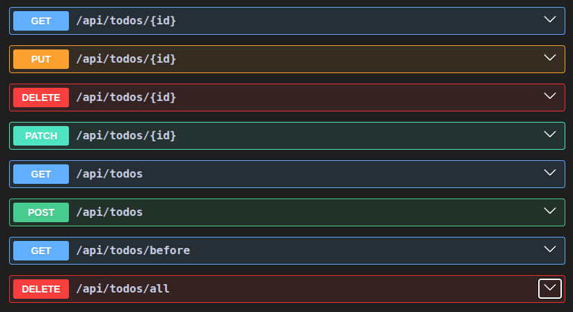

<p align="center">
  
  &nbsp;&nbsp;&nbsp;
  
</p>

# Spring Boot / Kotlin Todo app API

This document explains in detail how the Todo app API was made



<h2> Spring Boot </h2>

In this section you will find everything related to the Spring Boot setup

### 📦 Dependencies

```kotlin
// build.gradle.kts

dependencies {
	implementation("org.springframework.boot:spring-boot-starter-data-jdbc")
	implementation("org.springframework.boot:spring-boot-starter-web")
	implementation("com.fasterxml.jackson.module:jackson-module-kotlin")
	implementation("org.jetbrains.kotlin:kotlin-reflect")
	implementation("com.mysql:mysql-connector-j")
	implementation("org.jetbrains.kotlin:kotlin-stdlib-jdk8")
	implementation("org.springdoc:springdoc-openapi-starter-webmvc-ui:2.8.8")
	implementation("org.springframework.boot:spring-boot-starter-validation")
	testImplementation("org.springframework.boot:spring-boot-starter-test")
	testImplementation("org.jetbrains.kotlin:kotlin-test-junit5")
	testRuntimeOnly("org.junit.platform:junit-platform-launcher")
	developmentOnly("org.springframework.boot:spring-boot-devtools")
}
```

**Explanation**:

| Dependency                                                                 | Purpose                                                                 |
|---------------------------------------------------------------------------|-------------------------------------------------------------------------|
| `org.springframework.boot:spring-boot-starter-data-jdbc`                 | Enables Spring Data JDBC support for database interactions.             |
| `org.springframework.boot:spring-boot-starter-web`                       | Provides web and RESTful API capabilities with Spring MVC.              |
| `com.fasterxml.jackson.module:jackson-module-kotlin`                     | Adds support for Jackson JSON serialization/deserialization for Kotlin. |
| `org.jetbrains.kotlin:kotlin-reflect`                                    | Enables Kotlin reflection, required by frameworks like Spring.          |
| `com.mysql:mysql-connector-j`                                            | MySQL JDBC driver for connecting to a MySQL database.                   |
| `org.jetbrains.kotlin:kotlin-stdlib-jdk8`                                | Kotlin standard library for JDK 8.                                       |
| `org.springdoc:springdoc-openapi-starter-webmvc-ui:2.8.8`               | Generates Swagger/OpenAPI docs for your REST API.                       |
| `org.springframework.boot:spring-boot-starter-validation`               | Adds support for validation annotations like `@Valid`, `@NotNull`, etc. |
| `org.springframework.boot:spring-boot-starter-test`                     | Testing support including JUnit, Hamcrest, and Mockito.                 |
| `org.jetbrains.kotlin:kotlin-test-junit5`                                | Enables JUnit 5 support for Kotlin tests.                               |
| `org.junit.platform:junit-platform-launcher`                             | Required for launching JUnit 5 tests.                                   |
| `org.springframework.boot:spring-boot-devtools`                         | Provides hot reload and development-time enhancements.                  |


### 📁 Project structure

```
src/main/kotlin/com/example/todo_app/
├── common/
│   └── ApiResponse.kt
│   └── ApiResponseExtensions.kt
├── config/
│   └── JdbcAuditingConfig.kt
├── controller/
│   └── TodoController.kt
├── dto/
│   ├── CreateTodoRequest.kt
│   ├── UpdateTodoRequest.kt
│   ├── TodoResponse.kt
│   └── PartialUpdateTodoRequest.kt
├── exception/
│   └── GlobalExceptionHandler.kt
│   └── NotFoundException.kt
├── mapper/
│   └── TodoMapper.kt
├── model/
│   └── Todo.kt
├── repository/
│   └── TodoRepository.kt
├── service/
│   └── TodoService.kt
└── TodoAppApplication.kt
```

**Explanation**:


| 📁 Folder                 | 🔍 Purpose |
|-------------------------|---------|
| `common/`               | Contains general-purpose utilities and shared classes used across multiple layers. For example: `ApiResponse` and extensions for consistent API wrapping. |
| `config/`               | Holds Spring configuration classes such as auditing, CORS, or other custom setup beans. |
| `controller/`           | Defines the web layer (HTTP endpoints). Handles incoming requests and delegates to services. |
| `dto/`                  | Contains Data Transfer Objects used for input/output in the controller layer (e.g., request and response bodies). |
| `exception/`            | Centralized error handling classes. Includes custom exceptions and the global `@ControllerAdvice` to standardize error responses. |
| `mapper/`               | Houses functions that convert between entities and DTOs (e.g., domain-to-response, request-to-entity). |
| `model/`                | Contains domain entities (e.g., `Todo`) that represent database tables and business data. |
| `repository/`           | Interfaces for data access, typically extending Spring Data interfaces (e.g., `CrudRepository`). |
| `service/`              | Business logic layer. Encapsulates data access, validation, and use-case logic. Called by controllers. |
| `TodoAppApplication.kt` | The main Spring Boot entry point (`@SpringBootApplication`). Starts the application. |

### 🛠️ Configuration

#### MySQL connection

First, we need to configure Spring Boot to connect to our MySQL database by specifying the `url`, `username`, `password`, and the driver class name in the application.properties file:

```bash
# application.properties

spring.datasource.url=jdbc:mysql://localhost:3306/todo_app?useSSL=false&serverTimezone=UTC
spring.datasource.username=root
spring.datasource.password=0000
spring.datasource.driver-class-name=com.mysql.cj.jdbc.Driver
```

Next, here is the schema for our todos table:

```sql
-- schema.sql

CREATE TABLE IF NOT EXISTS todos (
  id BIGINT NOT NULL AUTO_INCREMENT PRIMARY KEY,
  title VARCHAR(255),
  description VARCHAR(255),
  completed BOOLEAN DEFAULT 0,
  created_at DATETIME NOT NULL DEFAULT CURRENT_TIMESTAMP,
  updated_at DATETIME NOT NULL DEFAULT CURRENT_TIMESTAMP ON UPDATE CURRENT_TIMESTAMP
);
```

#### Auditing

The `@EnableJdbcAuditing`annotation is part of Spring Data JDBC, and it's used to enable auditing features in your application. Auditing is the process of automatically capturing and populating metadata such as:

- Created date
- Last modified date
- Created by
- Last modified by

What does `@EnableJdbcAuditing` do?
When you add @EnableJdbcAuditing to a Spring configuration class, it:

- Activates auditing support for Spring Data JDBC repositories.
- Registers necessary infrastructure beans (like AuditingEntityCallback) to automatically populate auditing fields.
- Looks for specific annotations in your entities to mark fields for auditing (see below).

```kotlin
// JdbcAuditingConfig.kt

@Configuration
@EnableJdbcAuditing
class JdbcAuditingConfig
```

```kotlin
// Todo.kt

@Table("todos")
data class Todo(
    @Id val id: Long? = null,
    val title: String,
    val description: String,
    val completed: Boolean = false,

    @CreatedDate // <-- Auditing field
    @Column("created_at")
    val createdAt: LocalDateTime? = null,

    @LastModifiedDate // <-- Auditing field
    @Column("updated_at")
    val updatedAt: LocalDateTime? = null
)
```

#### Debugging

Some logging features that can come in handy while developing and debugging

```bash
# Debug

logging.level.org.springframework.jdbc.core=DEBUG
logging.level.org.springframework.jdbc.core.StatementCreatorUtils=TRACE

logging.level.org.springframework.web=DEBUG
logging.level.org.springframework.web.filter.CommonsRequestLoggingFilter=DEBUG
```


#### Exception handling

Why use a `GlobalExceptionHandler` at all?

The purpose of `@ControllerAdvice` with a `GlobalExceptionHandler` is to:

- Provide user-friendly responses (instead of raw stack traces or HTML error pages). This way all responses look consistent, making frontend handling simpler
- Return appropriate HTTP status codes (e.g., 400, 404, 422, etc.)
- The global handler catches exceptions and returns structured `ApiResponse` with `success=false`
- Avoid leaking sensitive info in error messages
- Still log or inspect full stack traces as needed internally
- You keep your controller code clean and focused on happy path logic

Best practice:

You should explicitly handle common client-side errors like `MethodArgumentNotValidException` (400 validation failure), `HttpMessageNotReadableException` (400 malformed JSON), `EntityNotFoundException` (404 Not found). For truly unexpected or internal errors (e.g. `NullPointerException`, `SQLException`), you should let them bubble up or catch with a generic fallback (but log them and return a 500).

Note on `@ControllerAdvice`

In a Spring Boot application, `@ControllerAdvice` is a powerful annotation that allows you to handle exceptions globally, rather than catching them in each individual controller. It acts as an interceptor of exceptions thrown by methods annotated with @RequestMapping (or its variants like @GetMapping, @PostMapping, etc).

This helps you separate error-handling logic from your controller code and ensures consistent HTTP responses for errors.

## 📚 Theory

There are some common and best practices outlined in this section.

### How it all works together

In a typical Spring Boot application, we use controllers, services, and repositories to structure the application according to the MVC (Model-View-Controller) and layered architecture principles. These components interact in the following manner:

1. The `Controller` receives an HTTP request (e.g. `GET /api/todos`)
2. It delegates to a `Service` method (e.g. `getAllTodos`)
3. The `Service` fetches data using a `Repository` (e.g. `findAll`), applies business rules or transformations
4. The result is returned back up the chain - from the service to the controller - which returns it in the HTTP response


### DTO vs Model (a.k.a Entity)

**Model** - The actual business object, typically mapped to a database table. This is you _internal_ full representation of your data that often contains all fileds - even internal ones like `id`, `createdAt`, etc. We use the Model for business logic and data persistance

**Example**

```kotlin
@Table("todos")
data class Todo(
    @Id val id: Long? = null,
    val title: String,
    val description: String,
    val completed: Boolean = false,
    val createdAt: LocalDateTime? = null,
    val updatedAt: LocalDateTime? = null
)
```

**DTO** - A lightweight object used for transferring data between layers or over the network. Another way to put it, this is a simplified or shaped version of your model. We used it to send data to/from clients, not for DB persistance. It often contains only the fields you want to expose

**Example**

```kotlin
data class CreateTodoRequest(
    val title: String,
    val description: String
)
```

<h2> Kotlin</h2>

This section highlights some key Kotlin idioms and patterns used throughout the codebase.

#### Extension functions

Kotlin extension functions allow us to add functionality to existing classes without modifying their source code. They're used heavily in this app for clean conversion between layers, such as DTO ↔ Entity mappings and response formatting.

```kotlin
fun CreateTodoRequest.toEntity(): Todo { ... }

fun Todo.toResponse(): TodoResponse { ... }
```

#### Companion objects

Companion objects in Kotlin are used to define static-like members within a class - such as constants or factory methods  -  without needing to instantiate the class.

In this project, the `ApiResponse` class uses a companion object to define convenient factory methods for success and error responses:

```kotlin
data class ApiResponse<T>(
    val success: Boolean,
    val data: T? = null,
    val error: String? = null
) {
    companion object {
        fun <T> success(data: T): ApiResponse<T> =
            ApiResponse(success = true, data = data)

        fun <T> failure(message: String): ApiResponse<T> =
            ApiResponse(success = false, data = null, error = message)
    }
}
```

#### Data classes

Kotlin’s data class automatically provides `equals`, `hashCode`, `toString`, and `copy` methods - perfect for DTOs and immutable-like domain models.

Used for modeling request and response payloads cleanly:

```kotlin
data class CreateTodoRequest(
    val title: String,
    val description: String
)

data class TodoResponse(
    val id: Long,
    val title: String,
    val description: String,
    val completed: Boolean,
    val createdAt: LocalDateTime,
    val updatedAt: LocalDateTime
)
```

Also used elegantly in partial updates via `.copy()`:

```kotlin
val updated = existing.copy(
    title = req.title ?: existing.title,
    ...
)
```

#### Null safety

Kotlin enforces null safety at the language level, reducing the chance of runtime `NullPointerExceptions`.

You can see this in how `findTodoById` safely returns a nullable value:

```kotlin
fun findTodoById(id: Long): Todo? = todoRepository.findByIdOrNull(id)
```

And then is explicitly checked in the controller:

```kotlin
val todo = todoService.findTodoById(id) ?: throw NotFoundException(...)
```

#### Lambda expressions

Lambda expressions are used throughout, for example when transforming data or sorting:

```kotlin
val todos = todoRepository
    .findByCreatedAtBefore(date)
    .sortedByDescending { it.createdAt }
```

Also used in mapping lists:

```kotlin
todoService.getAllTodos().map { it.toResponse() }
```

#### Named arguments

Kotlin allows for named arguments, which let you explicitly specify the name of each parameter when calling a function or constructor:

```kotlin
ApiResponse(success = false, data = null, error = message)

// vs
// ApiResponse(false, null, message)
```

This idiom improves readability by making it clear what each value represents, and it also allows you to pass arguments in any order. Named arguments are especially useful when dealing with functions or constructors that have many parameters, default values, or nullable types.